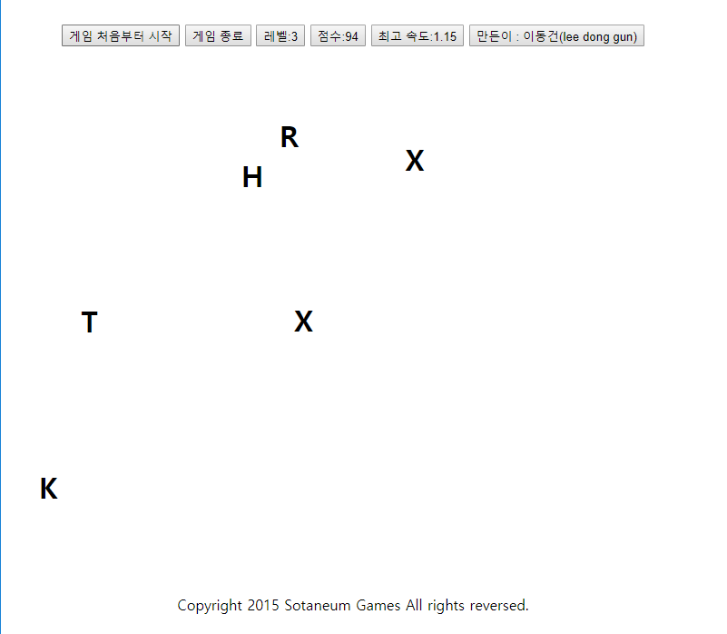

# Click-To-Click-Game

클릭 클릭 게임

## Play

- [`Game Play`](http://duration.digimoon.net/dev/game/ClickToClick/)

## Info

- 싱글 플레이 전용
- 조작키
  - 마우스 클릭
- 스토리
  - 영어 울렁증 때문에 알파벳이 이리저리 움직이는 증상이 생긴 당신이 할 수 있는 건 선택해서 없애는 것뿐입니다.
  - 이러저리 떠다니는 알파벳을 제거해 점수를 획득하세요.
- 특징
  - 레벨이 오를 수록 알파벳의 개수도 증가하고 속도도 증가합니다.
  - 게임 오버는 자신이 포기할 때에만 발생합니다.

## What did you learn

- HTML5와 Javascrip를 공부할 수 있었습니다.
- Javascript로 랜덤값을 지정하여 각 알파벳을 가진 객체를 생성해내는 방법에 대해 생각하고 구현할 수 있었습니다.

## Finally

- HTML5와 Javascript를 공부하면서 `이런식으로 게임을 만들어 볼 수 있을 까` 라는 생각으로 시작했습니다.

## Modify Content

- 2015.09.04
  - 개발

## Copyright

- 비상업적 용도로 사용 가능하며 링크를 반드시 포함해주세요.
- 문제가 되는 내용이 있다면 언제든지 [`issue`](https://github.com/Sotaneum/Click-To-Click-Game/issues/new), [`Pull requests`](https://github.com/Sotaneum/Click-To-Click-Game/compare) 부탁드립니다.
